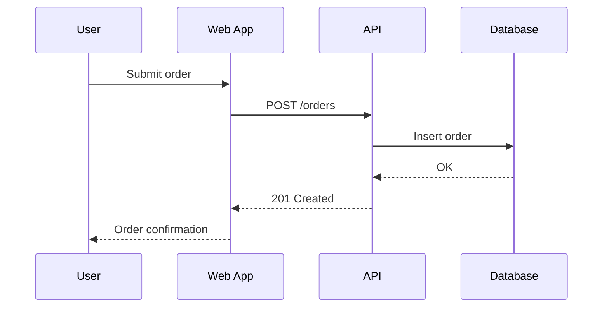

# Sequence Diagrams — {Project Name}

> Guidance: Only diagram flows that are non-obvious, cross multiple
> services, or are business-critical (checkout, auth, payment). Don't
> diagram every CRUD call.

## Flow: {Name, e.g., "User Checkout"}

**Notes:**
- Failure modes: TBD
- Idempotency considerations: TBD
- Timeout/retry behavior: TBD
